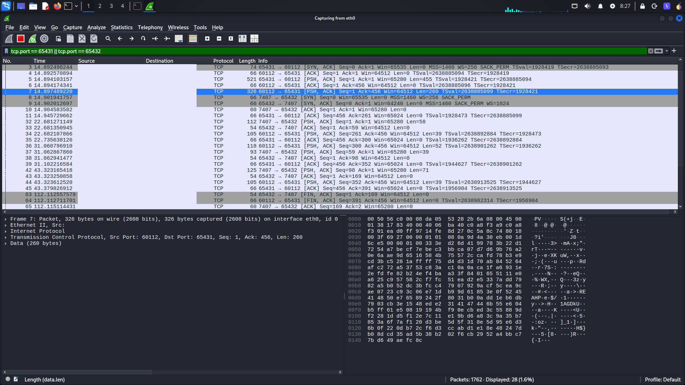

# 🔐 SecureS2S
### RSA + AES-GCM Encrypted Server-to-Server Communication System


A secure peer-to-peer server communication system implementing a **hybrid cryptographic architecture** using **RSA-2048** for secure key exchange and **AES-256-GCM** for authenticated encrypted messaging, carried over a **length-prefixed framing layer** so TCP's stream semantics can never desynchronize the protocol.

The project demonstrates how modern secure communication protocols such as **TLS**, **HTTPS**, and **SSH** establish secure channels by combining asymmetric and symmetric cryptography — and how real message-oriented protocols have to solve the TCP framing problem to do it reliably.

---

# 📑 Table of Contents

- [Features](#-features)
- [Architecture](#-architecture)
- [Demo](#-demo)
- [Installation](#-installation)
- [Usage](#-usage)
- [Project Structure](#-project-structure)
- [Security Analysis](#-security-analysis)
- [Challenges & Solutions](#-challenges--solutions)
- [Future Improvements](#-future-improvements)
- [Technologies Used](#-technologies-used)
- [License](#-license)
- [Disclaimer](#-disclaimer)
- [Contact](#-contact)

---

# 🌟 Features

## 🔑 RSA Secure Key Exchange
- Generates a 2048-bit RSA key pair.
- Uses RSA-OAEP with SHA-256.
- Securely exchanges the AES session key.
- Prevents exposure of symmetric keys over the network.

---

## 🔒 AES-256-GCM Authenticated Encryption
- Encrypts all communication using AES-256-GCM.
- Provides confidentiality, integrity, and authenticity.
- Automatically validates message integrity during decryption.
- Drops corrupt or tampered payloads without crashing the receive loop.

---

## 🎲 Random Nonce Generation
- Generates a fresh 96-bit nonce for every encrypted message.
- Prevents nonce reuse attacks.
- Follows NIST recommendations for AES-GCM.

---

## 📦 Length-Prefixed Message Framing
- Every payload — the RSA public key, the wrapped session key, and every encrypted message — is sent with a 4-byte big-endian length header.
- `recv_exact()` blocks until the full declared payload has arrived, eliminating TCP short reads.
- Prevents the handshake or the encrypted stream from ever desynchronizing due to partial or coalesced `recv()` calls.

---

## 🔄 Full Duplex Communication
- Supports simultaneous sending and receiving.
- Uses multithreading for bidirectional communication.
- Two `threading.Event` flags (`key_established`, `send_ready`) coordinate outgoing messages and ACKs so neither thread blocks on a socket that isn't ready yet.
- Mimics real-world secure communication systems.

---

## 📨 Automatic Delivery Acknowledgements
Messages automatically generate encrypted acknowledgements, gated by a 5-second readiness timeout so the receive thread can never hang indefinitely on a not-yet-connected outbound socket.

Example:

```text
> Hello Server B
(Arrived)
```

This confirms that the message was successfully decrypted and received by the remote server.

---

## 📡 Wireshark Verifiable Encryption
Network traffic can be inspected using Wireshark.

Captured packets contain only encrypted binary payloads and no plaintext application data.

Example filter:

```text
tcp.port == 65431 || tcp.port == 65432
```

---

## 🛡 Message Integrity Protection
AES-GCM automatically detects:

- Modified packets
- Bit-flipping attacks
- Message tampering
- Invalid authentication tags

---

## ⚡ Lightweight and Minimal Dependencies
Requires only:

- Python standard library
- Cryptography package

No external brokers or frameworks are required.

---

# 🏗 Architecture

```text
                    RSA KEY EXCHANGE (length-prefixed)
┌─────────────────────────────────────────────┐
│                                             │
│  Server A generates RSA key pair            │
│                                             │
│  Server A ── send_framed(Public Key) ──► B  │
│                                             │
│  Server B generates AES-256 key             │
│                                             │
│  Server B ── send_framed(RSA(AES Key)) ► A  │
│                                             │
└─────────────────────────────────────────────┘

                 SECURE CHANNEL ESTABLISHED

┌─────────────────────────────────────────────┐
│                                             │
│   AES-256-GCM Encrypted, Length-Prefixed    │
│              Communication                   │
│                                             │
│      Server A ◄══════════════════► Server B │
│                                             │
└─────────────────────────────────────────────┘
```

Every arrow above is a `send_framed()`/`recv_framed()` call, not a raw `sendall()`/`recv()` — the 4-byte length header is what lets each side reconstruct exact message boundaries regardless of how the TCP stack chunks the underlying bytes.

---

# 🎥 Demo

## Architecture Screenshot



## Demonstration Video

Watch the project demonstration video here:

https://drive.google.com/drive/folders/1Nj8TFVBfTfe7szLYRo91aSQZ5-aqncpW?usp=sharing

## 📖 Case Study

[](https://usfahmed.dev/projects/secure-s2s)

A comprehensive technical article explaining the architecture, cryptographic workflow, framing protocol, implementation details, security trade-offs, and future improvements.

---

# ⚙️ Installation

## Clone Repository

```bash
git clone https://github.com/usfa7med/SecureS2S.git
cd SecureS2S
```

---

## Install Dependencies

```bash
pip install -r requirements.txt
```

---

# 🚀 Usage

## Configure IP Addresses

Inside:

```text
server_A.py
server_B.py
```

Set:

```python
REMOTE_HOST = "192.168.x.x"
```

to the actual IP address of the peer machine on your network. (The checked-in files use a placeholder, `HOST_IP_ADDRESS`, so the real address is never committed to the repo — replace it with a literal string or load it from an environment variable before running.)

---

## Start Server A

```bash
python server_A.py
```

---

## Start Server B

```bash
python server_B.py
```

---

## Begin Messaging

Example:

```text
> Hello
> This message is encrypted.
> Hybrid cryptography is awesome.
```

---

# 📂 Project Structure

```text
SecureS2S/
│
├── assets/
│   └── photo.png
│
├── crypto.py        # RSA/AES primitives + send_framed/recv_framed/recv_exact
├── server_A.py
├── server_B.py
│
├── LICENSE
├── README.md
└── requirements.txt
```

---

# 🔍 Security Analysis

| Security Property | Status |
|------------------|--------|
| Confidentiality | ✅ |
| Integrity | ✅ |
| Authentication | ✅ |
| Message Boundary Integrity | ✅ |
| Replay Protection | ⚠ Partial |
| Forward Secrecy | ❌ |
| Perfect Forward Secrecy | ❌ |

---

# ⚠ Challenges & Solutions

## Problem:
Transmitting AES keys directly over the network would expose them to interception.

## Solution:
Used RSA-OAEP encryption to securely exchange the AES session key.

---

## Problem:
AES-CBC encryption does not guarantee message integrity.

## Solution:
Implemented AES-GCM authenticated encryption.

---

## Problem:
Static IV reuse could compromise encrypted traffic.

## Solution:
Generated a new random nonce for every encrypted message.

---

## Problem:
TCP is a byte stream, not a message protocol — a single `recv(4096)` call could return a partial message, a full message, or several messages concatenated together, silently corrupting the handshake or breaking AES-GCM decryption.

## Solution:
Added a length-prefixed framing layer (`send_framed`/`recv_framed`/`recv_exact`) so every payload is read exactly once, byte-for-byte, regardless of how the kernel chunks the underlying TCP stream.

---

## Problem:
The receive thread could send an encrypted ACK before the outbound socket to the peer had finished connecting, risking a hang.

## Solution:
Added a dedicated `send_ready` event with a 5-second timeout guard around every outbound write triggered from the receive thread.

---

## Problem:
Console input and incoming messages overlapped visually due to multithreading.

## Solution:
Implemented thread-safe console printing using locks.

---

# 🔮 Future Improvements

- ECDHE key exchange for Perfect Forward Secrecy
- X.509 certificate authentication
- Digital signatures
- Sequence numbers for replay protection
- Automatic key rotation
- Mutual authentication
- TLS-like handshake implementation
- Multi-client support
- Group encrypted communication
- GUI application interface

---

# 🛠 Technologies Used

## Programming Language
- Python

## Networking
- TCP Sockets
- Multithreading
- Custom length-prefixed framing protocol

## Cryptography
- RSA-2048
- RSA-OAEP
- AES-256-GCM
- SHA-256

## Libraries
- cryptography

## Security Analysis
- Wireshark

---

# 📄 License

This project is licensed under the MIT License.

See the `LICENSE` file for more details.

---

# ⚠ Disclaimer

This project was developed for educational and research purposes only.

It is not intended to replace TLS or other production-grade secure communication protocols.

For real-world deployments, proper certificate management, authentication, replay protection, and Perfect Forward Secrecy should be implemented.

---

# 📫 Contact

**Youssef Ahmed Abdelfatah**

Portfolio: https://usfahmed.dev

GitHub: https://github.com/usfa7med

LinkedIn: https://linkedin.com/in/usfahmed

Email: hello@usfahmed.dev
